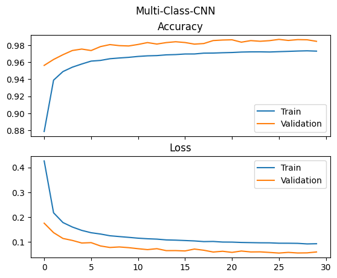
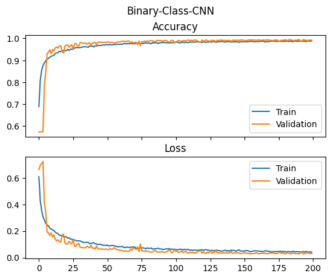
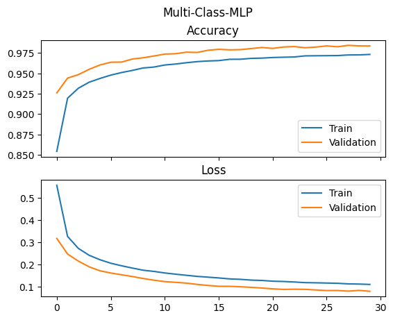
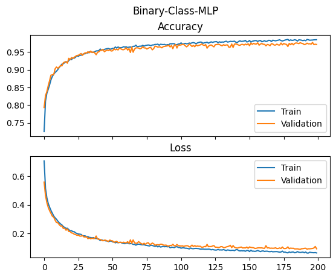

# mitbih-ptbdb-ecg-heartbeat-categorization
We used these [datasets](https://www.kaggle.com/datasets/shayanfazeli/heartbeat) to train a CNN and an MLP.

## Datasets
### MITBIH
cat-tab-1

Samples Count: 109446

Categories Count: 5

Sampling Frequency: 125Hz

Data Source:  Physionet's MIT-BIH Arrhythmia Dataset

Categories:

- N : Non-ecotic beats (normal beat)
- S : Supraventricular ectopic beats 
- V : Ventricular ectopic beats 
- F : Fusion Beats 
- Q : Unknown Beats

### PTBDB
cat-tab-2

Samples Count: 14552

Categories Count: 2

Sampling Frequency: 125Hz

Data Source: Physionet's PTB Diagnostic Database

## Data Balancing
We used Fourier method to generate more signals so all the categories are of the same size.

## Neural Networks Architectures
### CNN
### MLP

## Results
### CNN-MITBIH

### CNN-PTBDB

### MLP-MITBIH

### MLP-PTBDB

